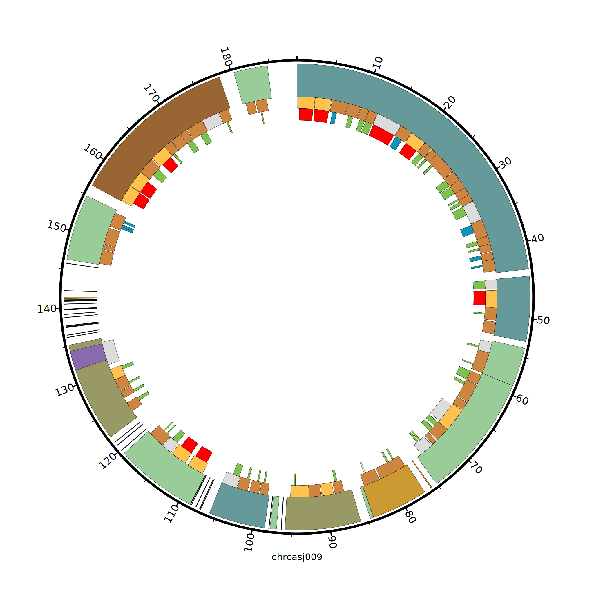

### `circos`
In this folder there are the files used to construct the circos plot shown in the manuscript. There are several files that contain the coordinates of genes, introns, and ORFs. The resulting plot has three tracks: the outmost track shows the genes, middle shows the introns, and the innermost shows the intronic ORFs

With `snakemake` installed, run:
```bash
snakemake -j 1
```

Figure should look like this:




