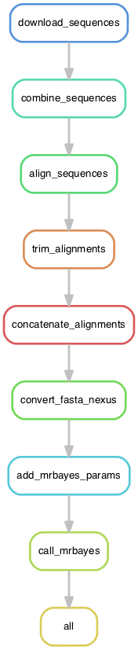

### `tree`

The purpose of this Snakemake pipeline is to produce a Bayesian phylogenetic tree with MrBayes using the mitochondrial gene sequences from different fungal species.

To execute the pipeline:

```bash
snakemake -j 1 --use-conda p
```

Parameters:

* `-j 1`: sets the number of cores to use.
* `--use-conda`: create a local conda environment where circos will be installed. Note the software to be installed (entrez-direct, fastp, hisat2, and SAMtools) is defined in the `myenv.yml` file.
* `-p`: print the shell commands that will be executed.

A brief description of what the rules in the `Snakefile` are doing is given below:


* `download_sequences`: dinamically download sequences from NCBI using `efetch`. It also replaces fasta IDs (accessions) with the organism's taxonomy IDs. This ID replacement is useful downstream to merge the sequences. The input table is the file `main_table_melt.txt`, which is a "melted" version of the table `main_table.csv`. This "melted" version was produced with the R script `scripts/melt_main_table.R`:

```r
Rscript scripts/melt_man_table.R main_table.csv main_table_melt.txt
```

* `combine_sequences`: concatenate sequences. Each gene will have its sequences from all the organims, i.e., orthologous gene sequences.
* `align_sequences`: use `mafft` to align the orthologous sequences
* `trim_alignments`: trim the alignment, removing columns with gaps.
* `concatenate_alignments`: use `pxcat` to concatenate the alignments to generate a tree.
* `convert_fasta_nexus`: generate a nexus file from the aligned fasta files. The nexus file is the input to mrbayes to build the tree.
* `add_mrbayes_params`: append mrbayes parameters at the end of the nexus file.
* `call_mrbayes`: build the tree.

This folder contains files utilized to construct the mitochondrial genome phylogenetic tree. `main_table.csv` contains the GenBank accession numbers of the genes and taxonomic information of the species. The auxiliary R script `scripts/melt_main_table.R` produces a melted (long format) of `main_table.csv`. The script relies on the `reshape` package. It can be called as:


Output of MrBayes will be in `concatenated_alignment/`.

A rule graph is shown below, produced with:

```
snakemake -n --rulegraph | dot -Tpng > dag.png
```




